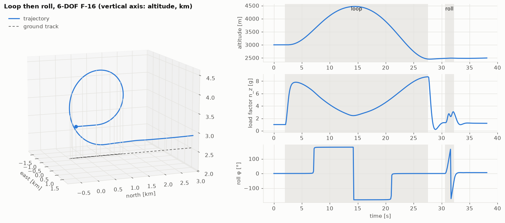
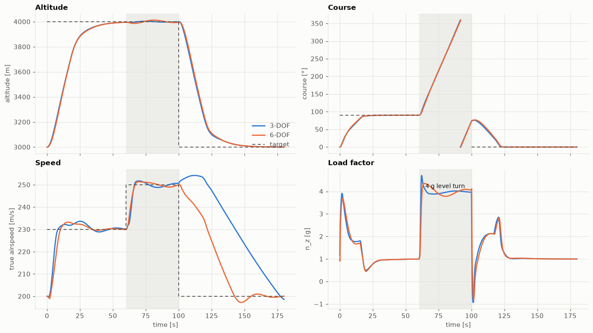
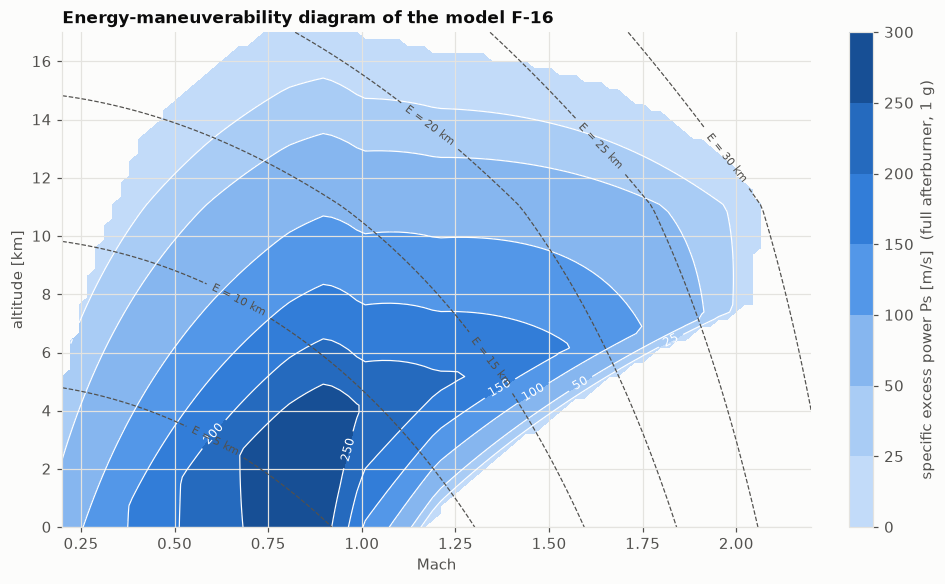

# jetfighter-sim

[](https://github.com/elouansalaun/jetfighter-sim/actions/workflows/tests.yml)


**A fighter-jet flight simulator (F-16 parameters), written from the physics up in Python and
validated layer by layer:** 3-DOF and 6-DOF flight dynamics built on NASA wind-tunnel data,
cockpit instruments and noisy sensors, flight-envelope protection, Tacview 3D export, and
classical flight control (fly-by-wire, autopilot, LQR).

> This is the simulator half of a two-repository project. The package it provides, `jetsim`,
> is the physics engine behind **[jetfighter-rl](https://github.com/elouansalaun/jetfighter-rl)**,
> where reinforcement-learning agents learn to fly maneuvers (stabilize, turn, navigate,
> aerobatics) on this aircraft.



## Highlights

- **Two aircraft models behind one interface.** A fast 3-DOF point mass (≈ 360× real time)
  for prototyping, and a 6-DOF rigid body (≈ 75× real time) driven by its real control
  surfaces, using the F-16 aerodynamic and engine tables of NASA TP-1538 (Stevens & Lewis).
- **Validated before it is used.** 596 tests cover analytic solutions, published F-16
  performance, trim, natural modes and conservation laws.
- **Quaternion attitude, RK4 at 100 Hz.** No gimbal lock at the top of a loop; Euler angles
  are only used for display.
- **Instruments and sensors.** TAS/CAS/EAS, Mach, load factor, angles of attack and sideslip,
  and optional noise and bias from YAML sensor models; an envelope monitor detects stalls,
  overspeed, overstress and ground impact.
- **Flight control.** PID with anti-windup, a gain-scheduled fly-by-wire (load-factor and
  roll-rate commands, α and g limiters, yaw damper) that stabilizes the relaxed-stability
  configuration, a cascaded autopilot, a longitudinal LQR, and scripted evasion maneuvers.
- **Visualization.** Bit-exact flight recording and replay, matplotlib dashboards, and
  [Tacview](https://www.tacview.net/) `.acmi` export; fly it yourself with a keyboard or
  joystick (pygame).

## Validation at a glance

The 3-DOF model against published F-16 figures (`python scripts/phase2_performance.py`):

| Quantity | Model | Public reference |
|---|---|---|
| Max Mach at sea level | 1.18 | ≈ 1.2 |
| Max Mach at 11 km | 2.08 | ≈ 2.0 |
| Max climb rate at sea level | 275 m/s | ≈ 250 m/s |
| Ceiling (0.5 m/s climb) | 17.7 km | 15.2 km (operational) |
| Sustained turn rate, 3 km, Mach 0.8 | 18.3 °/s | ≈ 18–20 °/s |

The 6-DOF model's natural modes at 3000 m, 200 m/s (`python scripts/phase3_validation.py`):
short period ω = 2.1 rad/s, ζ = 0.56; phugoid of period 107 s; Dutch roll ω = 3.6 rad/s,
ζ = 0.12; roll subsidence τ = 0.28 s; slow spiral mode τ = 98 s.

| Autopilot mission on both models | Energy-maneuverability diagram |
|---|---|
|  |  |

## Quickstart

```bash
git clone https://github.com/elouansalaun/jetfighter-sim.git && cd jetfighter-sim
uv venv && uv pip install -e ".[dev]"     # or: python -m venv .venv && pip install -e ".[dev]"
uv run pytest
```

Fly the 6-DOF F-16 with the autopilot and export the flight to Tacview:

```python
import math

from jetsim.aircraft import dynamics_6dof as d6
from jetsim.aircraft.instruments import read_instruments
from jetsim.aircraft.params import load_aircraft
from jetsim.control.autopilot import Autopilot, AutopilotTargets
from jetsim.viz.recorder import FlightRecorder
from jetsim.viz.tacview import export_recording

model = d6.F16SixDof(load_aircraft("f16"))  # rigid-body F-16, NASA wind-tunnel tables
x, u = model.trim(3000.0, 200.0)  # trimmed level flight at 3000 m, 200 m/s
ins = read_instruments(model, x)

autopilot = Autopilot(model)
autopilot.reset(x, ins)
autopilot.targets = AutopilotTargets(altitude=4000.0, heading=math.radians(90), airspeed=230.0)

rec = FlightRecorder(model, physics_dt=0.01, substeps=2)
for k in range(3000):  # 60 s: autopilot at 50 Hz, physics at 100 Hz (RK4)
    u = autopilot.controls(ins, 0.02)
    rec.record(k * 0.02, x, u)
    x = model.step(model.step(x, u), u)
    ins = read_instruments(model, x)

print(f"{ins.altitude:.0f} m, heading {math.degrees(ins.course):.0f}°, {ins.tas:.0f} m/s")
export_recording(rec.finish(), "climb_and_turn.acmi")  # open in Tacview
```

### Use it from another project

`jetsim` ships its aircraft data inside the package, so it works the same when installed from
GitHub:

```bash
pip install "jetsim @ git+https://github.com/elouansalaun/jetfighter-sim.git@v0.1.0"
```

This is how [jetfighter-rl](https://github.com/elouansalaun/jetfighter-rl) depends on it.

## Demo scripts

| Phase | Command | Output |
|---|---|---|
| 2 | `python scripts/phase2_performance.py` | flight envelope, climb and turn performance vs published data |
| 3 | `python scripts/phase3_validation.py` | trim table, natural modes, control responses of the 6-DOF |
| 4 | `python scripts/phase4_dashboard.py` | live instrument panel (true vs measured) until the envelope monitor ends the flight |
| 5 | `python scripts/demo_flight.py` | a loop then a roll, recorded, plotted and exported to Tacview |
| 5 | `python scripts/fly_manual.py` | fly the F-16 yourself (keyboard or joystick, needs `.[viz]`) |
| 6 | `python scripts/phase6_autopilot.py` | autopilot mission on both models, fly-by-wire step responses |

Figures and Tacview files land in [`results/`](results/) (the committed versions are
reference outputs), manual flights in `outputs/` (not versioned).

## Notebooks

A guided tour, one notebook per phase: the idea, the key equations, and runnable examples
on the real code. See [`notebooks/`](notebooks/).

| # | Notebook | Content |
|---|---|---|
| 0 | [Project overview](notebooks/00_project_overview.ipynb) | Goal, architecture, design decisions, conventions, validation at a glance |
| 1 | [Physics foundations](notebooks/01_physics_foundations.ipynb) | Reference frames, quaternions vs gimbal lock, ISA atmosphere, RK4 |
| 2 | [Point-mass 3-DOF](notebooks/02_point_mass_3dof.ipynb) | Drag polar, thrust, trim, flight envelope, turn performance, a loop |
| 3 | [Rigid-body 6-DOF](notebooks/03_rigid_body_6dof.ipynb) | NASA tables, static stability, CG, actuators, natural modes |
| 4 | [Instruments & envelope](notebooks/04_instruments_envelope.ipynb) | TAS/CAS/EAS, energy-maneuverability, noisy sensors, envelope monitor |
| 5 | [Visualization](notebooks/05_visualization.ipynb) | Recording, bit-exact replay, plots, Tacview export, manual flight |
| 6 | [Classical control](notebooks/06_classical_control.ipynb) | PID, fly-by-wire, autopilot, LQR, evasion primitives |


## Repository layout

```
src/jetsim/
├── core/        frames and rotations, ISA atmosphere, fixed-step integrators     (phase 1)
├── aircraft/    parameters, aerodynamics, propulsion, actuators,
│                3-DOF and 6-DOF dynamics, trim, linearization,
│                instruments, sensors, flight envelope                          (phases 2–4)
├── viz/         recorder and replay, plots, Tacview export, manual flight        (phase 5)
├── control/     PID, fly-by-wire, autopilot, LQR, maneuvers                      (phase 6)
└── data/        aircraft (f16.yaml, NASA tables) and sensor models (YAML)
scripts/         demos and validation scripts (one per phase)
tests/           unit and physical-validation tests
notebooks/       guided tour, phases 0–6
results/         reference figures and Tacview flights
project_roadmap.md   detailed roadmap and decision log
```

## Conventions

| Topic | Convention |
|---|---|
| Units | **SI everywhere** internally (m, s, kg, N, Pa, K); conversions only at the boundaries, via `jetsim.core.constants` |
| Angles | **Radians** internally; degrees only for display and human-readable config files |
| Inertial frame | **NED** (north, east, down), flat Earth; altitude `h = -z` |
| Body frame | **FRD**: x out the nose, y out the right wing, z down |
| Attitude | Unit quaternion `q = [q0, q1, q2, q3]` (scalar first, Hamilton), body → NED: `v_ned = C_nb(q) @ v_body`; renormalized after each step |
| Euler angles | Aeronautical **3-2-1** sequence (heading ψ, pitch θ, roll φ); display and observations only, never integrated |
| Aerodynamics | α = atan2(w, u), β = asin(v / V), with (u, v, w) the airspeed in body axes |
| Time step | Fixed-step physics at **dt = 0.01 s (100 Hz)** with RK4; controllers decide at 10–50 Hz |
| Matrix names | `C_ab` maps a vector from frame b to frame a: `v_a = C_ab @ v_b` |


## Development

```bash
uv pip install -e ".[dev,viz,notebooks]"
uv run pytest                       # 596 tests
uv run ruff check . && uv run ruff format .
pre-commit install                  # optional: lint on every commit
```

CI runs lint and the tests on Python 3.10 and 3.12.

## References

- B. L. Stevens, F. L. Lewis, E. N. Johnson — *Aircraft Control and Simulation* (F-16 model, 6-DOF equations)
- L. T. Nguyen et al. (1979) — NASA TP-1538, F-16 wind-tunnel aerodynamic data
- [Tacview](https://www.tacview.net/) ACMI format; [JSBSim](https://github.com/JSBSim-Team/jsbsim) for comparison

## License

[MIT](LICENSE) © Elouan Salaun
